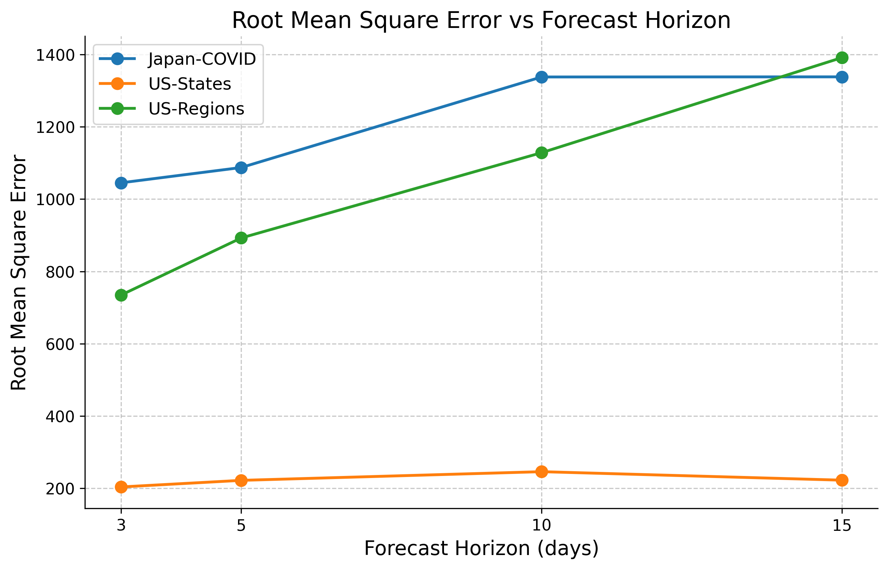
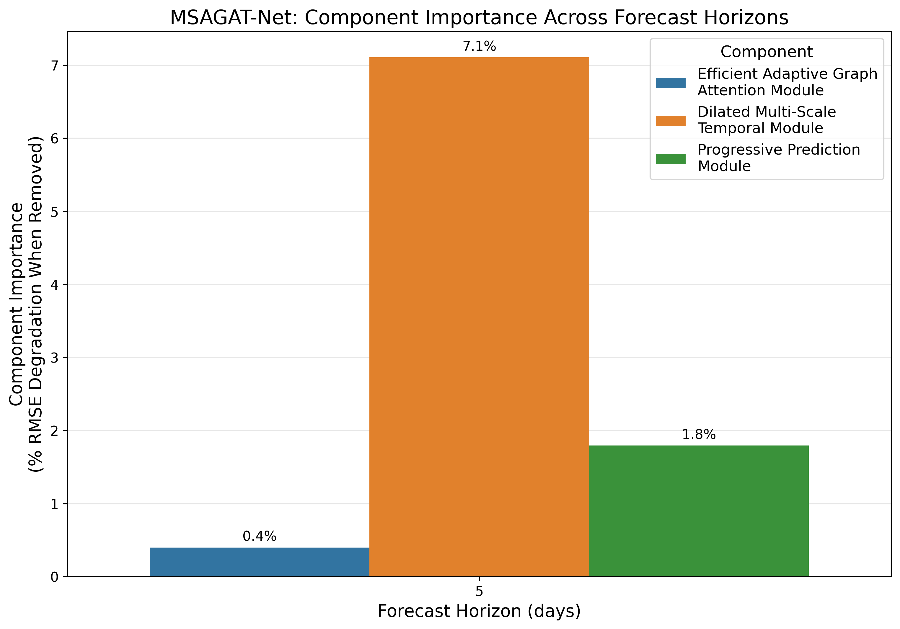

# MSAGATNet: Multi-Scale Adaptive Graph Attention Network for Epidemic Forecasting

MSAGATNet is a lightweight spatiotemporal deep learning framework specifically designed for epidemic forecasting across multiple geographical regions. The model combines efficient graph attention for spatial relationships with multi-scale temporal processing for accurate time-series forecasting.


## Model Architecture

MSAGATNet consists of three key components:

1. **Efficient Adaptive Graph Attention Module (EAGAM)**: Captures spatial dependencies between regions with linear complexity O(N) instead of quadratic O(N²)
2. **Dilated Multi-Scale Temporal Module (DMTM)**: Processes time-series patterns at different temporal resolutions using dilated convolutions
3. **Progressive Prediction Module (PPM)**: Enables region-aware multi-step forecasting with iterative refinement

## Key Features

- **Linear-time Attention Complexity**: Uses linearized attention with the ELU+1 kernel trick to achieve O(N) complexity
- **Low-Rank Factorization**: Employs parameter-efficient factorized representations in attention and projection layers
- **Multi-Scale Processing**: Captures temporal patterns at different resolutions with dilated convolutions
- **Adaptive Fusion**: Automatically learns optimal weights for combining multi-scale features
- **Regularized Graph Learning**: Incorporates L1 regularization for interpretable attention patterns

## Performance Highlights

Our experiments across multiple epidemic datasets show:

- **Superior Forecasting Accuracy**: Lower RMSE and MAE than state-of-the-art models across diverse datasets
- **Strong Correlation**: Higher Pearson Correlation Coefficient (PCC) and R² scores, indicating better capture of trend dynamics
- **Computational Efficiency**: Linear-time complexity with respect to the number of regions
- **Parameter Efficiency**: Significantly fewer parameters than comparable models through factorization techniques



## Datasets

The repository includes several epidemic datasets:
- Japan COVID-19 dataset (`japan.txt`) with adjacency information (`japan-adj.txt`)
- Spain COVID-19 dataset (`spain-covid.txt`) with adjacency information (`spain-adj.txt`)
- Australia COVID-19 dataset (`australia-covid.txt`) with adjacency information (`australia-adj.txt`)
- UK NHS regions dataset (`nhs_timeseries.txt`) with adjacency information (`nhs-adj.txt`)
- US state-level dataset (`state360.txt`) with adjacency information (`state-adj-49.txt`, `state-adj-50.txt`)
- US region-level dataset (`region785.txt`) with adjacency information (`region-adj.txt`)

## Quick Start

### Installation

```bash
# Clone the repository
git clone https://github.com/yourusername/MSAGAT-Net.git
cd MSAGAT-Net

# Install dependencies
pip install -r requirements.txt
```

### Training

Train the model with optimal parameters:

```bash
python src/train.py \
  --dataset japan \
  --sim_mat japan-adj \
  --window 20 \
  --horizon 5 \
  --hidden_dim 16 \
  --attn_heads 8 \
  --low_rank_dim 6 \
  --num_scales 5 \
  --kernel_size 3 \
  --temp_conv_out_channels 12 \
  --dropout 0.249 \
  --attention_reg_weight 1e-3 \
  --lr 0.001 \
  --weight_decay 5e-4 \
  --cuda \
  --mylog
```

```bash
python src/train.py   --dataset japan   --sim_mat japan-adj   --window 20   --horizon 5   --cuda   --seed 42   --batch 32   --epochs 1500   --lr 1e-3   --weight_decay 5e-4   --dropout 0.20   --patience 100   --lr_patience 20   --lr_factor 0.5   --attention_regularization_weight 1e-4   --num_scales 6   --kernel_size 9   --feature_channels 64   --bottleneck_dim 8
```

```bash
python src/train.py \
  --dataset japan \
  --sim_mat japan-adj \
  --window 20 \
  --horizon 5 \
  --cuda \
  --seed 42 \
  --batch 32 \
  --epochs 1500 \
  --lr 1e-3 \
  --weight_decay 5e-4 \
  --dropout 0.20 \
  --patience 100 \
  --attention_heads 4 \
  --attention_regularization_weight 1e-5 \
  --num_scales 4 \
  --kernel_size 3 \
  --feature_channels 16 \
  --bottleneck_dim 8
```

```bash
python src/train.py \
  --dataset japan \
  --sim_mat japan-adj \
  --window 20 \
  --horizon 5 \
  --train 0.5 \
  --val   0.2 \
  --test  0.3 \
  --cuda \
  --seed   42 \
  --batch  32 \
  --epochs 1500 \
  --lr              1e-3 \
  --weight_decay    5e-4 \
  --dropout         0.20 \
  --patience        100 \
  --attention_heads                  4 \
  --attention_regularization_weight  1e-5 \
  --num_scales      4 \
  --kernel_size     3 \
  --feature_channels 16 \
  --bottleneck_dim  8
```


```bash
python src/train.py `  --dataset japan `  --sim_mat japan-adj `  --window 20 `  --horizon 5 `  --hidden_dim 16 `  --attention_heads 8 `  --bottleneck_dim 6 `  --num_scales 5 `  --kernel_size 3 `  --feature_channels 12 `  --dropout 0.249 `  --attention_regularization_weight 1e-3 `  --lr 0.001 `  --weight_decay 5e-4 `  --cuda `  --mylog
```


### Prediction

Generate forecasts with a trained model:

```bash
python src/predict.py \
  --dataset japan \
  --sim_mat japan-adj \
  --window 20 \
  --horizon 5 \
  --model_path save/MSAGATNet.japan.w-20.h-5.pt \
  --output_dir predictions
```

## Model Variants and Ablation Studies

We conducted comprehensive ablation studies to evaluate the contribution of each major component to the model's performance. The ablation variants include:

- **Full Model**: The complete MSAGAT-Net with all components
- **No EAGAM**: Removes the Efficient Adaptive Graph Attention Module
- **No DMTM**: Removes the Dilated Multi-Scale Temporal Module
- **No PPM**: Removes the Progressive Prediction Module



Our analysis shows that each component contributes significantly to the model's overall performance, with EAGAM showing the most substantial impact on spatial-aware forecasting accuracy.

### Running Ablation Studies

```bash
# Run the full model
python src/train_ablation.py --dataset japan --sim_mat japan-adj --window 20 --horizon 5 --ablation none

# Run without Efficient Adaptive Graph Attention Module
python src/train_ablation.py --dataset japan --sim_mat japan-adj --window 20 --horizon 5 --ablation no_eagam

# Run without Dilated Multi-Scale Temporal Module
python src/train_ablation.py --dataset japan --sim_mat japan-adj --window 20 --horizon 5 --ablation no_dmtm

# Run without Progressive Prediction Module
python src/train_ablation.py --dataset japan --sim_mat japan-adj --window 20 --horizon 5 --ablation no_ppm
```

### Analyzing Ablation Results

After running ablation variants, analyze the results:

```bash
# Analyze all available ablation results automatically
python src/analyze_ablations.py --results_dir results --figures_dir report/figures
```

This generates:
- Comparison plots showing the impact of each ablation on model performance
- Component importance visualizations
- Detailed reports summarizing the findings

## Hyperparameter Optimization

MSAGATNet includes an Optuna-based hyperparameter optimization framework:

```bash
python src/optimize.py --dataset japan --sim-mat japan-adj --window 20 --horizon 5 --trials 100
```

The optimization process:
1. Automatically explores different hyperparameter combinations
2. Trains and evaluates models with early stopping
3. Tracks metrics including RMSE, PCC, and parameter efficiency
4. Saves detailed trial histories and best model checkpoints

## Visualizing Results

Generate publication-quality visualizations:

```bash
python generate_paper_visualizations.py --results_dir results --output_dir report/figures
```

This script produces:
1. Performance comparison plots across datasets and forecast horizons
2. Component importance visualizations showing which model parts contribute most

## Key Parameters

- `--dataset`: Name of the dataset (e.g., `japan`, `region785`, `state360`)
- `--sim_mat`: Name of the adjacency matrix file (e.g., `japan-adj`)
- `--window`: Input window size (default: `20`)
- `--horizon`: Prediction horizon (default: `5`)
- `--hidden_dim`: Hidden dimension size (default: `16`)
- `--attn_heads`: Number of attention heads (default: `8`)
- `--low_rank_dim`: Dimension for low-rank decompositions (default: `6`)
- `--num_scales`: Number of temporal scales in multi-scale module (default: `5`)
- `--kernel_size`: Size of temporal convolution kernel (default: `3`)
- `--temp_conv_out_channels`: Output channels for temporal convolution (default: `12`)
- `--dropout`: Dropout rate (default: `0.249`)
- `--attention_reg_weight`: Weight for attention regularization (default: `1e-3`)
- `--lr`: Learning rate (default: `0.001`)
- `--weight_decay`: Weight decay (default: `5e-4`)

## Project Structure

```
MSAGAT-Net/
├── data/                   # Epidemic datasets and adjacency matrices
├── optim_results/          # Hyperparameter optimization outputs
├── report/figures/         # Generated visualizations
├── results/                # Evaluation metrics and ablation results
├── save/                   # Saved model checkpoints
├── src/                    # Source code
│   ├── model.py            # MSAGATNet model implementation
│   ├── train.py            # Training script
│   ├── train_ablation.py   # Ablation study script
│   ├── analyze_ablations.py# Ablation analysis script
│   ├── optimize.py         # Hyperparameter optimization script
│   └── utils.py            # Utility functions
├── tensorboard/            # TensorBoard logs
└── generate_paper_visualizations.py  # Visualization script
```

## Citation

If you use this code in your research, please cite our work:

```bibtex
@article{msagatnet2025,
  title={MSAGATNet: Multi-Scale Adaptive Graph Attention Network for Epidemic Forecasting},
  author={Author Names},
  journal={Journal Name},
  year={2025}
}
```

## License

This project is licensed under the MIT License - see the LICENSE file for details.